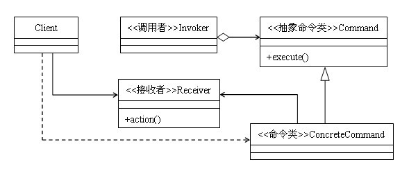

###UML

###命令模式

命令模式把发出命令的责任和执行命令的责任分割开，委派给不同的对象。

1. 客户端(Client)角色：创建一个具体命令(ConcreteCommand)对象并确定其接收者。
2. 命令(Command)角色：声明了一个给所有具体命令类的抽象接口。
3. 具体命令(ConcreteCommand)角色：定义一个接收者和行为之间的弱耦合；实现execute()方法，负责调用接收者的相应操作。execute()方法通常叫做执行方法。
4. 请求者(Invoker)角色：负责调用命令对象执行请求，相关的方法叫做行动方法。
5. 接收者(Receiver)角色：负责具体实施和执行一个请求。任何一个类都可以成为接收者，实施和执行请求的方法叫做行动方法。
	负责命令执行
6. 可以提供命令的撤销和恢复功能。

###命令模式的优点

1. 首先，命令模式的封装性很好：每个命令都被封装起来，对于客户端来说，需要什么功能就去调用相应的命令，而无需知道命令具体是怎么执行的。比如有一组文件操作的命令：新建文件、复制文件、删除文件。如果把这三个操作都封装成一个命令类，客户端只需要知道有这三个命令类即可，至于命令类中封装好的逻辑，客户端则无需知道。

2. 其次，命令模式的扩展性很好，在命令模式中，在接收者类中一般会对操作进行最基本的封装，命令类则通过对这些基本的操作进行二次封装，当增加新命令的时候，对命令类的编写一般不是从零开始的，有大量的接收者类可供调用，也有大量的命令类可供调用，代码的复用性很好。比如，文件的操作中，我们需要增加一个剪切文件的命令，则只需要把复制文件和删除文件这两个命令组合一下就行了，非常方便。

###缺点  
那就是命令如果很多，开发起来就要头疼了。特别是很多简单的命令，实现起来就几行代码的事，而使用命令模式的话，不用管命令多简单，都需要写一个命令类来封装。

###命令模式的适用场景

对于大多数请求-响应模式的功能，比较适合使用命令模式，正如命令模式定义说的那样，命令模式对实现记录日志、撤销操作等功能比较方便。

